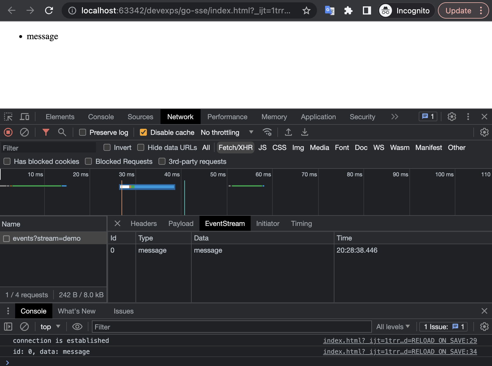

# go-sse
Server-Sent Events (SSE for short)

SSE is similar to WebSocket in that it establishes a communication channel between the browser and the server, and then the server pushes information to the browser. Overall, WebSocket is more powerful and flexible. Because it is a full-duplex channel, it can communicate in two directions; SSE is a one-way channel, which can only be sent from the server to the browser because streaming information is essentially downloading.

### Quick Start
To run example server:

```bash
go run cmd/server/main.go
```

Open the `index.html` file on your browser and get the result like this:

